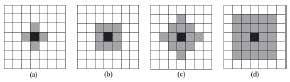
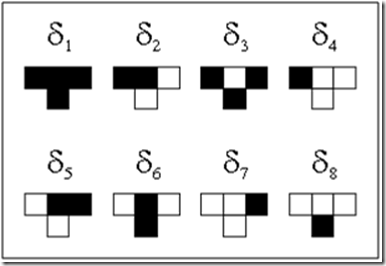

# 🤖 Automatas Celulares

Surgen en la decada de 1940 con John Von Neumann, que buscaba crear una maquina capaz de autoreplicarse (Creo un modelo matematico de esta)

*Tenian reglas complejas sobre una red rectangular* -> Conjunto de celulas que crecian, se reproducian y morian

Por definicion un **automata celular** -> *es un modelo matematico para un sistema dinamico compuesto por un conjunto de celdas o celulas que adquieren distintos estados o valores.* Los estados cambian en tiempos discretos y se puede modelar el comportamiento con una expresion que es sensible a los estados de las celular vecinas (***Regla de transicion local***)

## Elementos

- **Un espacio regular:** Puede ser una linea, espacio 2D o n-dimensional. Cada division homogenea es llamada celula
- **Conjunto de estados:** Es finito y cada celula toma un valor del conjunto de estados.
- **Configuracion inicial:** Valores iniciales de un estado a cada una de las celulas
- **Vecindades:** Define el conjunto de celulas que se consideran adyacentes, asi como posiciones relativas. Cuando el espacio es uniforme, la vecindad de cada celula es isomorfa (tiene el mismo aspecto)

- **Funcion de transicion local:** Regla de evolucion del automata. Se calcula a partir del estado de la celula y su vecindad. Define su nuevo estado a partir de su estado anterior. (*Expresion algebraica o grupo de ecuaciones*)

Los automatas llamaron la atencion en los 70s cuando John Conway desarrollo el juego de la vida. Este juego demuestra que reglas simples desencadenan cosas caoticas y complejas.

Estos sistemas complejos son dinamicos, por lo cual su estado se puede determinar a partir del estado anterior y de sus interacciones con el ambiente. Por lo general son continuos y se pueden manipular de forma discreta (tanto temporal como espacialmente)

### Complejidad

Esta emerge a partir de la interaccion de las celulas que siguen reglas simples. En ingles, un automata es *automaton* y un grupo de automatas es *automata*. Por lo tanto, decimos que el termino ***Cellular Automata*** surge de un grupo de automatas elementales.

### Vecindad

*"Dime con quien andas y te dire quien eres"* -Refran popular

Este concepto es fundamental en los automatas y nos dice que el comportamiento de una celula en el tiempo viene dado por el comportamiento de esta y el de sus vecinas. Es el conjunto de vecinos de una celula que influye en su comportamiento. Tanto asi que pasa en nuestras casas, trabajos, clases, desplazamientos o reuniones. Hay reglas implicitas de las cuales no somos conscientes, que si bien no estan formalmente establecidas, definen nuestro comportamiento.

## Definicion FORMAL

Un automata celular D-dimensional (AC-D) es una secuencia $C_t$, definida por una 5-tupla, $(L,w,U,f,C_o)$ donde:

- $L$: es un reticulo
- $w$: es un alfabeto, que representa los estados de la celda
- $U=(u_1, u_2, ..., u_n)$ es una secuencia finita de elementos del reticulo
- $f:w^u \rightarrow w$ es la funcion de transicion o regla local
- $C_o : L \rightarrow w$ es alguna configuracion inicial