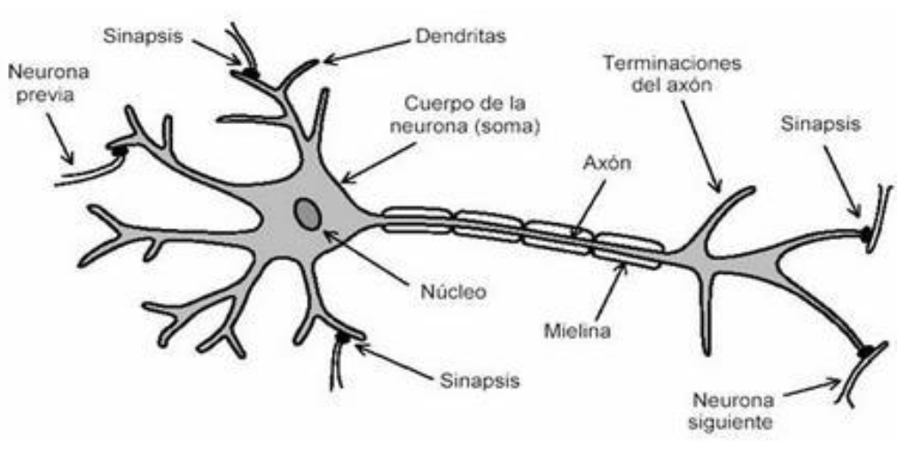

# 🧬 Introduccion a las Redes Neuronales Artificiales

La principal fuente de supervivencia de las especies proviene de datos obtenidos y filtrados por los sentidos. Se analizan en sus cerebros buscando **patrones** para determinar si hay presas, calculando esfuerzo para atraparlas o sis son presas para eludir los depredadores.

De esta interaccion con el ambiente realmente se hace **MACHINE LEARNING** ya que son gran cantidad de datos que se almacenan y se procesan.

### Modelo mental para predecir

Este elimina detalles no pertinentes y enfatiza en los detalles de interes *(features)*. Cuando el agente no detecta el patron adecuadamente debe realizar cambios en la estructura mental para adaptar el modelo.

El cambio que tenemos en la estructura se conoce como aprendizaje a partir de la experiencia. Esta replicacion y analisis viene dado por la capacidad del ser vivo la cual se ve mejor en el humano por su evolucion, por lo cual se quiso replicar esto de forma artificial. De alli surgen las *Redes Neuronales Artificiales* RNAs.

La unidad basica y fundamental de estas redes es la neurona artificial o perceptron.

## Modelos de Neuronas

### Neurona Natural

De forma simplificada consta de un nucleo, un cuerpo denominado soma, al cual estan conectadas unas fibras nerviosas llamadas dendritas, fibras terminales de entrada y un axon, que es una fibra delgada y larga que se divide en su extremo en una serie de fibras terminales de salida.

Recibe señales de entrada proveniente de otras celulas nerviosas por las dendritas. Se generan impulsos de otras neuronas generando una conexion llamada sinapsis (conexion mas fuerte o mas debil dependiendo de la importancia de las señal que llega)

Las señales son de tipo electrico