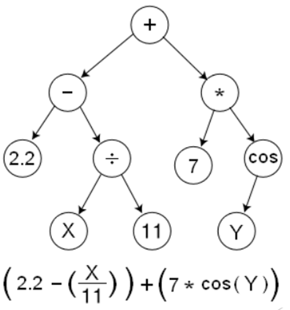
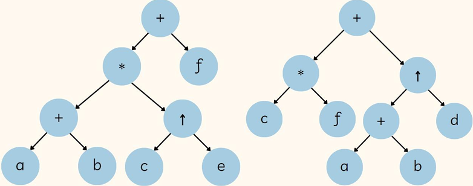

# 🖥️ Programacion Genetica

Uno de los primeros fue Lawrence Fogel (1964). John Koza fue el principal promotor de la PG

Es un retoño de los algoritmos geneticos -> Los cromosomas que sufren la adaptacion son arboles que representan programas. ***Son en si mismos programas de computador***.

## Caracteristicas clave:

- **Material Genético no lineal:** Estructurado explicitamente en forma de arbol.
- **Longitud variable:** Permite crecimiento de la estructura segun las necesidades del problema
- **Material genetico ejecutable:** El genotipo es equivalente al fenotipo, ya que la estructura misma es interpretada y ejecutada para medir su comportamiento
- **Preservacion sintactica:** El operador de cruce asegura que los programas resultantes mantengan la validez sintactica en el lenguaje elegido.

## Estructura de datos de la PG

Se busca responder como hacer para que las computadoras aprendan a resolver problemas sin ser programadas explicitamente.

### Arboles binarios

Los nodos internos son funciones y los nodos externos son terminales

## Pasos para aplicar la PG

1. **Define el problema:** Claridad sobre el problema que se va a solucionar por PG y su dominio, tambien se usa en el analisis de datos a traves de regresiones, clasificacion; *circuitos logicos*
2. **Define el conjunto de terminales (T):** Son las variables y constantes
3. **Define el conjunto de funciones (F):** Son las operaciones propias del dominio. Con los dos conjuntos se tiene una propiedad de clausura
4. **Medida de aptitud (fitness):** Cada programa individual en la poblacion, se mide en terminos de que tan bien se comporta en el ambiente del problema particular (La naturaleza de la medida de aptitud varia con el problema)
5. **Parametros:** Tenemos dos parametros:
    - **K:** Numero de arboles en la poblacion
    - **M:** Numero de generaciones del algoritmo
    - ***f:*** funcion de aptitud aplicada al problema, no hay decodificación
6. **Criterio de terminacion:** El resultado del algoritmo es el mejor individuo que aparece en cada generación.

## Solucion de problemas

- **Ciclo evolutivo**

    1. Generacion de una poblacion inicial aleatoria de arboles programa
    2. Evaluacion iterativa: Asignacion de aptitud ejecutando cada programa
    3. Creacion de nueva poblacion: Aplicacion de reproduccion (copia), cruce (recombinacion de subarboles) y mutacion (modificacion aleatoria de funciones o terminales)
    4. Designacion del individuo con mayor aptitud al finalizar el proceso.

- **Mecanismo del cruce:** Se seleccionan dos arboles padres y puntos de cruce aleatorios en cada uno (numerando nodos en preorden). Se intercambian subarboles completos entre los padres, lo que garantiza hijos sintacticamente validos (El proceso tiende a aumentar la profundidad de los arboles)

## Estructuras de datos, Representacion y Recorrido

### Codificacion

Inspirada en lenguajes formales y teoria de compiladores, los nodos internos albergan funciones y los nodos hoja representan datos/terminales

### Representacion en memoria

Se trabaja mediante estructuras dinamicas con punteros (enlace izquierdo, informacion y enlace derecho)

### Recorridos de los arboles binarios

Para este tema tomaremos como ejemplo el arbol binario que se ve en la siguiente imagen:

Con esto podemos hacer el orden de busqueda y numerado de las siguientes formas:

- Preorden: **R**ID -> +*cf^+abd
- Inorden: I**R**D -> c*f+a+b^d
- Posorden: ID**R** -> cf*ab+d^+